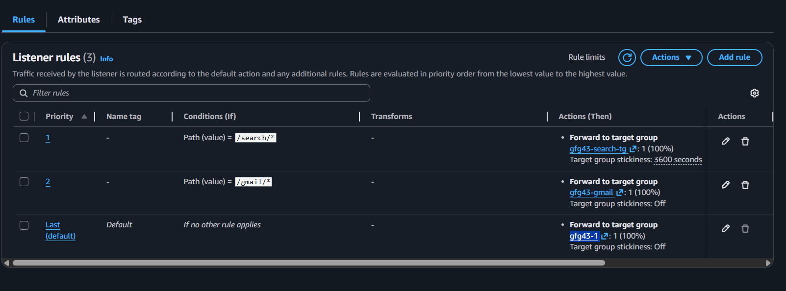

## Auto Scaling Groups and Application Load Balancer (ALB) in AWS

### What is an Auto Scaling Group (ASG)?

* An Auto Scaling Group (ASG) in AWS is a feature that automatically adjusts the number of EC2 instances in a group based on defined conditions/rules. This ensures that your application has the right amount of compute capacity to handle its workload.

* Key Features of Auto Scaling Groups:

    * Automatic Scaling: Automatically increases or decreases the number of EC2 instances to match demand.
    * Health Monitoring: Regularly checks the health of instances and replaces unhealthy ones.
    * Load Balancing: Distributes incoming traffic across multiple instances when paired with a load balancer.
    * Cost Efficiency: Reduces costs by scaling down during low demand periods.

### Why is Auto Scaling Required?

* High Availability: Ensures your application remains available during spikes in traffic by scaling up.

* Fault Tolerance: Replaces failed or unhealthy instances to maintain optimal performance.

* Dynamic Workloads: Accommodates varying traffic patterns without manual intervention.

* Cost Optimization: Prevents over-provisioning by running only the necessary instances.

### What is an Application Load Balancer (ALB)?

* An Application Load Balancer (ALB) is a managed service in AWS that distributes incoming application traffic across multiple targets, such as EC2 instances, containers, and IP addresses. It operates at the application layer (Layer 7) of the OSI model and can route traffic based on content.

* Key Features of ALB:

    * Content-Based Routing: Routes requests to specific targets based on URL paths, host headers, or query strings.

    * Health Checks: Monitors the health of targets and routes traffic only to healthy ones.

    * WebSocket Support: Supports WebSocket for full-duplex communication.

    * SSL/TLS Termination: Offloads SSL/TLS decryption to the load balancer, improving performance.

### Integration with Auto Scaling Groups:

* Seamlessly works with ASGs to handle dynamically scaled targets. When combined, Auto Scaling Groups and Application Load Balancers ensure that your application is:

    * Scalable: Handles varying traffic loads by scaling EC2 instances.

    * Reliable: Automatically routes traffic to healthy and available instances.

#### Workflow of ASG and ALB Integration:

* Initial Setup: Launch an Auto Scaling Group and associate it with an ALB. Register targets (EC2 instances) in the ALB’s target group(This will be dynamically managed by ASG, You don't have to manually add instances here).

* Traffic Distribution: ALB receives incoming traffic and routes it to the healthy EC2 instances in the ASG.

* Health Checks: ALB periodically checks the health of targets. If an instance is unhealthy, ALB stops routing traffic to it.

* Dynamic Scaling: ASG dynamically adjusts the number of EC2 instances based on scaling policies (e.g., CPU utilization thresholds). for eg, If CPU Average Utilisation goes above 50% then it will launch more instances (Scale-Out), If their is less utilisation then it will remove unwanted instances for saving costs (Scale-Im)

* We will provide a Instance Template consists of our custom AMI(image) which will be used to launch ec2 instances(This custom image will already have all software and configuration installed and setuped). And Newly launched instances are automatically registered with the ALB.

#### Benefits of Using ASG and ALB Together:

* High Availability: Ensures traffic is routed only to healthy instances.

* Automatic Failover: Unhealthy instances are replaced and excluded from traffic routing.

* Efficient Traffic Management: Distributes incoming traffic evenly across all instances.

* Seamless Scaling: Scales resources up or down while maintaining consistent performance.

#### Example Use Case

* Web Application Hosting: An e-commerce website experiences high traffic during sales events. An Auto Scaling Group ensures there are enough instances to handle peak traffic. An Application Load Balancer evenly distributes user requests across the instances.

* Microservices Architecture: Each microservice is hosted on separate EC2 instances in an Auto Scaling Group. ALB routes traffic to the appropriate service based on the URL path.

