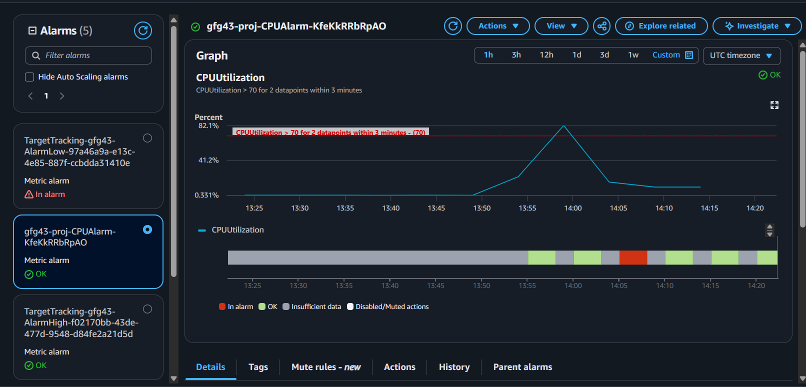

## AWS

* Create `aws-access-analyzer.json` and assign it to the user from which you are trying to use s3 service(while adding s3 bucket policy)

### AWS CLI Commands

* Install AWS CLI - `https://docs.aws.amazon.com/cli/latest/userguide/getting-started-install.html`
* Run Ec2 Instance -  `aws ec2 run-instances --image-id ami-0fd05997b4dff7aac --key-name augkeyun --instance-type t2.micro --region ap-south-1`
* List S3 Buckets - `aws s3 ls`
* AWS Ec2 Describe Instance - `aws ec2 describe-instances`
* Create presigned URL for accessing object stored in s3 - `aws s3 presign s3://gfg33/lion.jpeg --expires-in 3000`
* Cloudwatch alarm- 

### Important Link - 

* Allow only specific VPC endpoints or IP addresses to access my Amazon S3 bucket - `https://repost.aws/knowledge-center/block-s3-traffic-vpc-ip`
* AWS CLI Document - `https://docs.aws.amazon.com/cli/latest/reference/ec2/run-instances.html`
* AWS Policy Generator - `https://awspolicygen.s3.amazonaws.com/policygen.html`
